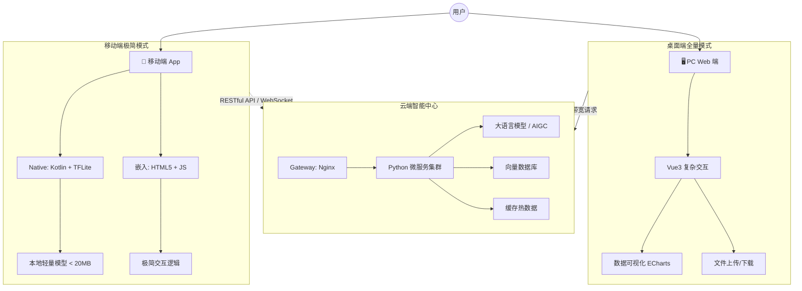

# 多端协同AI应用技术选型与架构白皮书（参考存档）

> **来源**：外部 AI 生成（用户 2026-09-02 提供，先经设计师评审分级）。
> **用途**：PC 端立项参考 + 理念吸收——**非 MOV 现行架构方案**。
> **评审结论**：①PC Web 管理端（Vue3+ECharts）→ 留作 PC 端参考 ②端云协同理念 → 吸收 ③协议统一（JSON over HTTPS）→ 已在做 ④智能路由（性能→轻/全模型）→ 已实现（模型管理通道 v5 + L 分层路由）⑤移动端 TFLite → 不采（Needle 搁置/DeepSeek 云端定案）⑥Python 云端智能中心 → 存档 PC 立项再评 ⑦移动/PC 共用 Vue 组件库 → 待定（倾向：引擎跨端，PC 不另起 Vue——「一次编写双端适配」用自有引擎实现，不用 Vue）。

---

## 原文（白皮书正文）

### 1. 核心设计哲学

「端侧轻量化，云端全量；体验优先，算力随行。」——根据设备物理资源（功耗/内存/算力）动态调整AI推理复杂度，端云协同。

### 2. 技术栈分层选型

| 应用场景 | 技术栈组合 | 核心策略 | 优势 |
|---|---|---|---|
| 移动端（App） | Kotlin + TensorFlow Lite | 端侧离线推理，调用 NPU | 低延迟、保护隐私、离线可用 |
| 移动端（Webview） | HTML5 + JavaScript (TensorFlow.js) | 轻量级网页嵌入，极简交互逻辑 | 热更新快，跨平台复用业务逻辑 |
| 桌面端/Web管理端 | HTML5 + Vue3 + ECharts | 复杂交互、数据可视化、全功能仪表盘 | 大屏展示，操作便捷，算力不受限 |
| AI服务端 | Python + FastAPI + PyTorch | 承载大模型（LLM）、AIGC 等重型计算 | 生态丰富，调参灵活 |

### 3. 系统架构图（Mermaid）

### 4. 关键实施路径

1. 协议统一：全端 JSON over HTTPS
2. 代码复用：PC 端与移动端 Webview 共用同一套 Vue 组件库（isMobile 环境变量控制 UI 复杂度）
3. 智能路由：API 网关按 UA + 设备性能评分分发轻/全模型

### 总结

保留 Kotlin 移动端原生性能 + Python AI 领域能力 + HTML5+JS 全端同源复用——规避「Python 写 App」与「纯 Web 套壳」两类缺陷。

---
