```mermaid
flowchart TD
  MOV["🌳 MOV"]
  n0["UI设计"]
  MOV --> n0
  n1["登录与合规弹窗"]
  n0 --> n1
  n2["✅UPG-09 MOV App 登录页实现"]
  n1 --> n2
  n3["✅UPG-13 登录页视觉修订"]
  n1 --> n3
  n4["✅UPG-15 登录页死锁修"]
  n1 --> n4
  n5["✅UPG-11 首启隐私政策弹窗"]
  n1 --> n5
  n6["聊天页"]
  n0 --> n6
  n7["✅UPG-20 聊天页 chips 改造 v"]
  n6 --> n7
  n8["✅UPG-12 WebView 引擎预热 +"]
  n6 --> n8
  n9["设置与页面收口"]
  n0 --> n9
  n10["✅UPG-14 设置页收口"]
  n9 --> n10
  n11["✅UPG-17 App demo 假数据全清"]
  n9 --> n11
  n12["品牌与图标"]
  n0 --> n12
  n13["✅UPG-19 应用图标换 MOV 竖眼 L"]
  n12 --> n13
  n14["设计规范"]
  n0 --> n14
  n15["UPG-24 MOV 设计规范 v1"]
  n14 --> n15
  n16["🔨UPG-25 UI 瑕疵批修"]
  n14 --> n16
  n17["结构设计"]
  MOV --> n17
  n18["工具体系"]
  n17 --> n18
  n19["📋UPG-01 全量工具元数据补全"]
  n18 --> n19
  n20["🔨UPG-02 设备类工具包迁移"]
  n18 --> n20
  n21["✅UPG-03 生活场景工具"]
  n18 --> n21
  n22["UPG-04 Obsidian 工具包迁移"]
  n18 --> n22
  n23["📋UPG-18 Android 死代码清理"]
  n18 --> n23
  n24["🔨UPG-23 本地 tab「本机能力总览」"]
  n18 --> n24
  n25["记忆与智能"]
  n17 --> n25
  n26["✅UPG-05 记忆体系回补"]
  n25 --> n26
  n27["UPG-06 确定性防编造回补"]
  n25 --> n27
  n28["UPG-22 记忆尾单"]
  n25 --> n28
  n29["预算与权限"]
  n17 --> n29
  n30["✅UPG-07 预算口径 + 用量计量 + "]
  n29 --> n30
  n31["构建与发布"]
  n17 --> n31
  n32["✅UPG-16 release 签名配置收口"]
  n31 --> n32
  n33["营销设计"]
  MOV --> n33
  n34["官网"]
  n33 --> n34
  n35["✅S-07 MOV 公众官网一期"]
  n34 --> n35
  n36["✅S-08 官网「能力市场」页"]
  n34 --> n36
  n37["市场站"]
  n33 --> n37
  n38["📋S-05 市场首页去 demo 化"]
  n37 --> n38
  n39["🔨S-06 市场站 bug 批修 + 死"]
  n37 --> n39
  n40["域与合规"]
  n33 --> n40
  n41["📋S-04 MOV 域迁移"]
  n40 --> n41
  n42["内部基建"]
  MOV --> n42
  n43["工作台"]
  n42 --> n43
  n44["✅UPG-08 mow.kim 工作台落地"]
  n43 --> n44
  n45["✅UPG-10 工作台 sync 状态语义细"]
  n43 --> n45
  n46["📋W-09 资产档案表"]
  n43 --> n46
  n47["📋W-10 事件日历视图 + 总览仪表盘"]
  n43 --> n47
  n48["📋W-12 workbench 前端小修"]
  n43 --> n48
  n49["账号服务"]
  n42 --> n49
  n50["🔨W-11 account-servic"]
  n49 --> n50
  classDef domain fill:#1a1a1a,color:#fff,stroke:#000
  classDef area fill:#f3f4f7,color:#1a1a1a,stroke:#c8c8cc
  class n0,n17,n33,n42 domain
  class n1,n6,n9,n12,n14,n18,n25,n29,n31,n34,n37,n40,n43,n49 area
```

# MOV

> 方向树根。Juggl 打开本笔记 → Local Graph → Layered 布局 = 组织结构图视角。
> 每个工单指向哪个方向，就是我们在往哪里努力。

- [[设计师/设计网络/方向/UI设计|UI设计]]
- [[设计师/设计网络/方向/结构设计|结构设计]]
- [[设计师/设计网络/方向/营销设计|营销设计]]
- [[设计师/设计网络/方向/内部基建|内部基建]]

## 组织树（自动生成，勿手改——由方向/工单 frontmatter 重建）

## 组织树（自动生成，勿手改——由方向/工单 frontmatter 重建）

## 组织树（自动生成，勿手改——由方向/工单 frontmatter 重建）

## 组织树（自动生成，勿手改——由方向/工单 frontmatter 重建）

## 组织树（自动生成，勿手改——由方向/工单 frontmatter 重建）

## 组织树（自动生成，勿手改——由方向/工单 frontmatter 重建）

## 组织树（自动生成，勿手改——由方向/工单 frontmatter 重建）

## 组织树（自动生成，勿手改——由方向/工单 frontmatter 重建）

